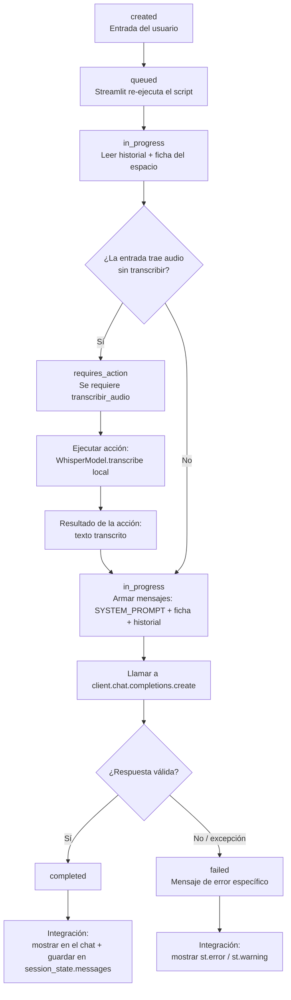

# Flujo de ejecución (Run) — Asesor DecoView

Este documento describe, paso a paso, el ciclo de vida de una interacción del usuario dentro de `app.py`: desde que llega un mensaje (escrito, por sugerencia o por voz) hasta que la respuesta del asistente queda integrada en la conversación.

> **Nota de terminología.** DecoView usa la API de **Chat Completions** de Groq (compatible con `openai`), no la *Assistants API* de OpenAI — por eso no existe un objeto `Run` real ni un estado `requires_action` nativo en el SDK. Este documento usa esa misma nomenclatura (`Run`, `requires_action`, `completed`…) como **modelo conceptual equivalente**, porque describe con precisión lo que ya ocurre en el código: el ciclo se detiene a esperar el resultado de una acción externa (transcribir el audio) antes de poder continuar, igual que un Run real se detiene a esperar la salida de una *tool call*. La sección 6 detalla esta equivalencia campo por campo.

---

## 1. Resumen del ciclo

```
created → queued → in_progress → [requires_action] → in_progress → completed/failed → integración
```

Cada turno de conversación pasa por estos estados. El paso `requires_action` es **condicional**: solo ocurre cuando la entrada del turno es un audio (grabado o adjuntado) que todavía no se transcribió. Un mensaje de texto normal, o una sugerencia, saltan directo de `in_progress` (preparación) a la llamada al modelo.

---

## 2. Tabla de estados

| Estado | Qué representa | Dónde ocurre en `app.py` |
|---|---|---|
| `created` | Llega una entrada nueva del usuario: texto, clic en una sugerencia, audio grabado o audio adjuntado ya transcrito. | `st.chat_input(...)`, `usar_sugerencia()`, botón **Enviar** del panel de adjuntar audio |
| `queued` | Streamlit encola el rerun del script tras la interacción; el valor entra a `session_state` (`pendiente` o el propio `entrada`). | Mecanismo interno de Streamlit + `st.session_state` |
| `in_progress` (preparación) | Se arma el contexto: se lee el historial (`st.session_state.messages`) y la ficha del espacio (`contexto_ficha()`). | Sección "Capturar la entrada del usuario" y `contexto_ficha()` |
| `requires_action` *(condicional)* | El turno **no puede avanzar** hasta resolver una acción externa: transcribir el audio recibido. Es el equivalente a un Run que se pausa a la espera de una *tool call*. | Bloque `if entrada.audio is not None: ... transcribir_audio(entrada.audio)` y el flujo de "Adjuntar audio" |
| *(sub-paso)* envío de la acción | Se ejecuta la "tool": `transcribir_audio()` guarda el audio en un archivo temporal y llama a `WhisperModel.transcribe()` (modelo Whisper local vía `faster-whisper`). | `transcribir_audio()` |
| *(sub-paso)* resultado de la acción | El texto transcrito hace de "tool output": se integra como si el cliente lo hubiera escrito. | `partes.append(transcribir_audio(...))` → `prompt` |
| `in_progress` (modelo) | Con el prompt ya resuelto (texto directo o transcripción), se arma la lista de mensajes (`SYSTEM_PROMPT` + ficha + historial) y se llama al modelo de Groq. | `client.chat.completions.create(...)` |
| `completed` | El modelo devuelve una respuesta con contenido válido. | `full_response = choice.message.content` |
| `failed` | La llamada falla (clave inválida, límite de Groq, sin conexión, respuesta vacía, etc.) — cada causa tiene su propio mensaje. | Bloque `except openai.*` y el chequeo de `full_response` vacío |
| Integración | El resultado (éxito o error) se muestra en pantalla y, si fue éxito, se guarda en el historial para los siguientes turnos. | `message_placeholder.markdown(...)` + `st.session_state.messages.append(...)` |

---

## 3. Diagrama del ciclo



---

## 4. Paso a paso, con el código que lo implementa

### 4.1 `created` — entrada del usuario
Hay tres vías de entrada, todas terminan en la misma variable `prompt`:

- **Texto escrito**: `entrada = st.chat_input(...)` → `entrada.text`.
- **Sugerencia**: `usar_sugerencia(texto)` deja el texto en `st.session_state.pendiente`.
- **Audio grabado**: llega dentro del mismo `entrada` (`entrada.audio`), gracias a `accept_audio=True` en `st.chat_input`.
- **Audio adjuntado**: se resuelve en un panel aparte (`st.popover("Adjuntar audio")`) y, al presionar **Enviar**, también termina en `st.session_state.pendiente`.

### 4.2 `queued`
Streamlit no tiene una cola explícita: cada interacción (tecla Enter, clic en un botón) dispara un *rerun* completo del script. Ese rerun es, en la práctica, el equivalente a que el Run pase de `created` a `queued` — la entrada ya quedó registrada en `session_state` y espera a que el script vuelva a ejecutarse de arriba hacia abajo.

### 4.3 `in_progress` (preparación del contexto)
Antes de tocar al modelo, el script arma el contexto con el que va a razonar:

```python
mensajes = list(st.session_state.messages)
ficha = contexto_ficha()
if ficha:
    mensajes.insert(1, {"role": "system", "content": ficha})
```

### 4.4 `requires_action` — la nota de voz
Este es el paso que pide explícitamente este documento. Ocurre **antes** de que el prompt quede definitivo:

```python
prompt = None
if entrada:
    partes = [entrada.text.strip()] if entrada.text.strip() else []
    if entrada.audio is not None:
        with st.spinner("Transcribiendo audio localmente…"):
            try:
                partes.append(transcribir_audio(entrada.audio))
            except Exception as e:
                st.error(str(e), icon=":material/error:", title="No se pudo transcribir el audio")
    prompt = "\n\n".join(parte for parte in partes if parte) or None
```

Por qué es un `requires_action` y no un paso más:

1. **El Run no puede completarse todavía.** El sistema ya tiene una entrada del usuario, pero esa entrada (audio) no sirve como prompt hasta que se resuelva una acción externa al modelo de lenguaje.
2. **La acción es una "tool" local, no el LLM.** `transcribir_audio()` no le pregunta nada a Groq: guarda el archivo, corre `WhisperModel.transcribe()` (Whisper `base`, vía `faster-whisper`, cacheado con `@st.cache_resource`) y borra el temporal. Es exactamente el rol de una función/tool en el patrón `requires_action` → `submit_tool_outputs`.
3. **El resultado se "envía de vuelta" al ciclo.** El texto transcrito se agrega a `partes` y de ahí pasa a ser `prompt`, tal como una Run real retoma su ejecución cuando recibe el resultado de la tool.
4. **Si la acción falla, el Run también falla ahí mismo** (bloque `except`), sin llegar a llamarse al modelo — se muestra `st.error(...)` y el turno termina sin generar una respuesta del asistente.

El caso del audio **adjuntado** (no grabado) tiene una variante: el `requires_action` ocurre *antes* de que exista un Run de chat en absoluto, dentro del panel "Adjuntar audio", y su resultado quede en un cuadro de texto editable. Ahí se agrega un sub-paso humano — el cliente debe confirmar con **Enviar** — antes de que el texto pase a `st.session_state.pendiente` y recién entonces arranque el ciclo descrito en este documento.

### 4.5 `in_progress` (llamada al modelo) → `completed` / `failed`
Con el prompt ya resuelto (sea texto directo o transcripción), se arma el mensaje del usuario, se agrega al historial y se llama al modelo:

```python
response = client.chat.completions.create(
    model=GROQ_MODEL,
    messages=mensajes,
    temperature=0.6,
    max_tokens=1200,
)
choice = response.choices[0]
full_response = choice.message.content
```

- **`completed`**: `full_response` tiene contenido → se considera una respuesta válida.
- **`failed`**: dos formas.
  - Una excepción de la librería `openai` (clave inválida, límite de tasa, timeout, sin conexión, modelo inexistente, error del servidor, etc.) — cada una con su propio `st.error(...)`.
  - Una respuesta técnicamente exitosa pero vacía (el modelo se quedó sin tokens "pensando") — se detecta con `if not full_response.strip()` y se muestra `st.warning(...)` en vez de un mensaje en blanco.

### 4.6 Integración del resultado en la respuesta del asistente
Es el paso final del Run, y el que hace que todo lo anterior tenga efecto visible:

```python
message_placeholder.markdown(full_response)
st.session_state.messages.append({"role": "assistant", "content": full_response})
```

- El texto se pinta en el `st.chat_message("assistant")` que ya estaba reservado con `st.empty()`.
- Se agrega a `st.session_state.messages`, así queda disponible como parte del historial para el **siguiente** Run (paso 4.3 de la próxima interacción).
- Si el Run terminó en `failed`, este paso no ocurre: solo se muestra el mensaje de error y el historial no crece, para no "ensuciar" la conversación con una respuesta que nunca existió.

---

## 5. Ejemplo aplicado

**Entrada:** el cliente graba una nota de voz diciendo *"Busco un sofá para una sala de tres por cuatro metros"*.

1. `created`: `entrada.audio` llega con el `UploadedFile` del audio grabado.
2. `queued`: Streamlit re-ejecuta el script.
3. `in_progress`: se lee el historial (vacío o con turnos previos) y la ficha del espacio.
4. `requires_action`: `entrada.audio is not None` → se llama a `transcribir_audio(entrada.audio)`.
   - Acción: Whisper transcribe el archivo temporal.
   - Resultado: `"Busco un sofá para una sala de 3 x 4 metros."`
5. Ese texto se vuelve `prompt` y sigue el flujo normal: se agrega a `st.session_state.messages` como mensaje del usuario.
6. `in_progress` (modelo): se llama a Groq con `SYSTEM_PROMPT` + ficha + historial (incluyendo el mensaje recién transcrito).
7. `completed`: el modelo responde con una recomendación de sofá.
8. Integración: la respuesta se muestra en el chat y se guarda en el historial.

---

## 6. Equivalencia de términos (para quien conozca la Assistants API)

| Término usado aquí | En la Assistants API de OpenAI | En DecoView |
|---|---|---|
| `Run` | Objeto que representa la ejecución de un hilo contra un asistente | Un turno completo de conversación, de la entrada del usuario a la respuesta mostrada |
| `requires_action` | El Run se pausa porque el asistente pidió ejecutar una o más *tool calls* | El turno se pausa porque hay un audio sin transcribir; la "tool" es `transcribir_audio()` |
| *tool call* | Función que el modelo pide ejecutar, con argumentos definidos por el modelo | Llamada a `WhisperModel.transcribe()`, decidida por el código (no por el LLM) — es una tool *determinística*, no elegida dinámicamente por el modelo |
| `submit_tool_outputs` | Se le devuelve al Run el resultado de la tool para que continúe | El texto transcrito se agrega a `partes` / `prompt` y el flujo continúa |
| `completed` | El Run terminó con una respuesta del asistente | `full_response` llega con contenido válido |
| `failed` | El Run terminó en error | Excepción de `openai.*` o respuesta vacía del modelo |

**Diferencia clave:** en la Assistants API real, es el **modelo** quien decide cuándo se necesita una tool call (`requires_action` lo dispara el LLM). En DecoView, quien decide que hace falta una acción es **el código de la aplicación** (si hay audio, hay que transcribirlo, sin que el LLM tenga que pedirlo) — el LLM nunca ve el audio, solo el texto ya transcrito. La analogía sigue siendo válida para describir el *ciclo de pausa y reanudación*, pero vale aclarar quién toma la decisión en cada caso.
